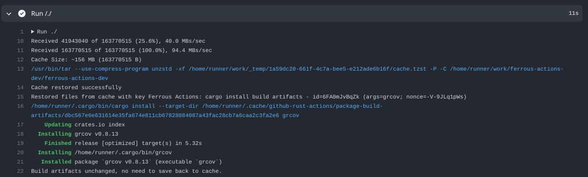
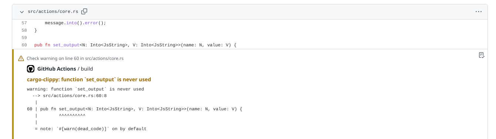

# Ferrous Actions
[](https://github.com/FrancisRussell/ferrous-actions-dev/actions?query=workflow%3ACI)

GitHub action for easing Rust development, written in Rust and compiled to
WebAssembly.

## About

[actions-rs](https://github.com/actions-rs), the de-facto default for
Rust-related GitHub actions appears to be all but abandoned. This repository is
an experiment in replacing those actions with ones written in Rust, but
compiled down to WebAssembly. This should make them both portable across
platforms and more easily maintainable by developers who only know Rust.

Please note the the development repository for this action is located
[here](https://github.com/FrancisRussell/ferrous-actions-dev/) whereas the
release repository is located
[here](https://github.com/FrancisRussell/ferrous-actions/). Issues should be
filed against the former.

## Features at a glance

* Installs Rust toolchains via [Rustup](https://rustup.rs/).
* Intelligent caching of Cargo home (crates, registry indices and Git
  repositories):
  * Separate caching of registry indices, Git repositories and crate files.
  * Only uploads new versions of cache entries when they have changed.
  * Parameterizable minimum update interval (for fast changing items like
    registry indices).
  * Capable of detecting and dropping unused crate files, Git repositories and
    registry indices on Unix-like platforms (on Windows this is not possible so
    cache entries are keyed with the hash of all present `Cargo.lock` files).
  * Detects races between concurrent CI jobs (since a workflow may contains
    multiple jobs) to update the same cache entry and avoids uploading multiple
    versions.
  * Separates caching of content from dependency tracking of each CI job to
    permit sharing and avoid CI jobs with differing dependencies fighting over
    what needs to be cached.
  * Caches can be shared across platforms (Linux, Darwin and Windows).
* Caching of build artifacts from `cargo install` operations to accelerate
  installation.
* Supports the usage of [cross](https://github.com/cross-rs/cross) for
  cross-compilation.
* Generates GitHub annotations from output of `cargo clippy`, `cargo build` and
  `cargo check` operations.

## Usage

Like all GitHub actions, this action is used via directives in a [GitHub
Actions YAML
file](https://docs.github.com/en/actions/using-workflows/workflow-syntax-for-github-actions).
For practicality and implementation reasons, Ferrous Actions is structured as
a ‘mono-action’, meaning that all operations are implemented as sub-commands of
a single action rather than being separated. The `command` parameter is always compulsory.

In all following examples, `FrancisRussell/ferrous-actions@v0.1.0-beta.2`
should be replaced by the version of the action that this README is for. An
example of the usage of Ferrous actions in a real project can be found
[here](https://github.com/FrancisRussell/zoog/blob/develop/.github/workflows/ci.yml).

Note that by default, GitHub will use the name of action as the name of a build
step in its user interface. This can be confusing since with a mono-action
these are always the same.  Liberal use of the `name` attribute is recommended
and is used in the examples below.

### Caching Cargo home

Registry indices (e.g. the list of packages on `crates.io`), crate files and
Git repositories downloaded by Cargo can all be cached between CI jobs.

File modification timestamps are used to detect if no changes to the cached items
have occurred and avoid needlessly uploading them back to the cache.

Example invocation:
```yml
- uses: FrancisRussell/ferrous-actions@v0.1.0-beta.2
  name: Cargo cache
  with:
    command: cache
    cache-only: indices
    min-recache-crates: 1m
    min-recache-git-repos: 12h
    min-recache-indices: 7d
```

The following options are also available:

* `cache-only` (optional): a whitespace separated list of the token
  `git-repos`, `crates` and `indices`. If provided, only these items will be
  cached. The default is to cache all items.
* `min-recache-crates` (optional): minimum time before recaching crates. 
* `min-recache-git-repos` (optional): minimum time before recaching Git
  repositories.
* `min-recache-indices` (optional): minimum time before recaching registry
  indices.
* `cross-platform-sharing` (optional): Attempt to share Cargo
  home caches across all platforms (`all`), only Unix-like platforms
  (`unix-like`), or make all caches platform-specific (`none`). The default is
  `all`.

All recaching intervals are specified in [human
time](https://docs.rs/humantime/latest/humantime/). Specifying the recaching
interval makes it possible to avoid uploading a new version of a cached item
each time it changes. This is useful for registry indices which (in the case of
`crates.io`) can be large (hundreds of MiBs), often modified, but only with
small changes. At writing, the index minimum recache interval is 2 days and
none is specified for crate files or Git repositories.

### Installing a Rust toolchain with Rustup

Ferrous actions can download Rustup and install a specified Rust toolchain.

Example invocation:
```yml
- uses: FrancisRussell/ferrous-actions@v0.1.0-beta.2
  name: Install Rustup
  with:
    command: install-rustup
    toolchain: nightly
    target: wasm32-unknown-unknown
    profile: minimal
    default: true
```

The following options are also available:

* `toolchain` (required): The toolchain to install
* `target` (optional): A whitespace separated list of target architectures.
* `profile` (optional): The Rustup profile (e.g. `minimal`, `default` or
  `complete`). The default is `default`.
* `default` (optional): Whether this toolchain should be set as the Rustup
  default compiler. This defaults to `true`. _This is different to actions-rs's
  behaviour_.
* `override` (optional): Whether a Rustup ‘override’ should be set for the
  current directory. Defaults to `false`.

### Cargo commands

Cargo commands can be invoked via Ferrous actions. The value for `command` in
this case is `cargo SUBCOMMAND` where `SUBCOMMAND` is a single token.

Example invocation:
```yml
- uses: FrancisRussell/ferrous-actions@v0.1.0-beta.2
  name: Cargo build
  with:
    command: cargo build
    toolchain: stable
    args: --release
```

The following options are available whenever a Cargo subcommand is invoked:
* `toolchain` (optional): A toolchain identifier that will be passed to `cargo`
  using the `+toolchain` syntax (only supported by Rustup-installed
  toolchains).
* `args` (optional): Command line flags passed to `cargo`. These will be parsed
  using Unix-style shell quoting rules regardless of platform.

### Installing a package with Cargo install

Ferrous actions will use GitHub's caching mechanism to improve the performance
of installing binaries compared to compiling them from scratch each time. Note
that Ferrous actions currently aims towards transparent tool caching - the
cache should not result in you using a version of a binary you would not
otherwise had you not used the cache.



This means that Ferrous actions caches the build artifacts folder rather than
the built binaries themselves. The only way to only cache the latter would be
to be completely certain of all dependencies prior to the build,
[Nix-style](https://nixos.org/).

From the user-perspective this means:
* Tools will be recompiled from scratch when they are compiled with a
  previously unseen version of a Rust toolchain. If you track nightly, this
  might happen relatively frequently.
* Any changes to a tool (because it or its dependencies have been updated in a
  registry) will be immediately reflected in the result of an install action.
  The updated build artifacts will be pushed back to the GitHub cache when this
  happens.

Example invocation:
```yml
- uses: FrancisRussell/ferrous-actions@v0.1.0-beta.2
  name: Install grcov
  with:
    command: cargo install
    args: grcov
```

The following options have additional constraints:

* `args` (required): As above, but at least the binary name is required. Note
  that the command line is hashed to produce the cache key so changes will
  cause a tool to be rebuilt from scratch.

When invoked via Ferrous actions, `cargo install` will execute in a different
directory to the current one. The aim here is to avoid either a
`rust-toolchain.toml` or a Rustup override changing the compiler used to
compile the binary.

### Getting annotations from cargo build, check or clippy

When the `build`, `check` or `clippy` Cargo subcommands are run via Ferrous actions,
annotations are output which can be viewed via the GitHub UI.



Example invocation:
```yml
- uses: FrancisRussell/ferrous-actions@v0.1.0-beta.2
  name: Cargo clippy
  with:
    command: cargo clippy
    annotations: true
```

The following options are also available:

* `annotations` (optional): Can be set to `true` or `false` depending on
  whether annotations are desired. Default is `true`.

### Cross support

Invocation of `cargo build` via Ferrous actions can also be done in such a way
that the [cross](https://github.com/cross-rs/cross) tool is used.

Example invocation:
```yml
- uses: FrancisRussell/ferrous-actions@v0.1.0-beta.2
  name: Cargo build
  with:
    command: cargo build
    args: --target=x86_64-apple-darwin
    use-cross: true
```

If `use-cross` is specified as `true` then `cross` will be used for
compilation. If is supplied as `false` or not at all then `cargo` will be
invoked as normal. If an existing `cross` binary is not available, then one
will be built and installed.

## Implementation Notes

### The monotonically increasing cache problem

One major issue with caching is how to ensure that a cache does not
monotonically increase in size. There are two places where this can occur: the
cached cargo home artifacts, and cached binary intermediate build artifacts.
This problem is only partially solved.

On Linux and Apple systems, file access times are used to determine what
entries in cached cargo home items were accessed and to prune items that
weren't. This has been implemented such that it still works in the presence of
‘relatime’ semantics - when the file access timestamp is only updated if it is
behind the modification timestamp. 

File access times are typically disabled under Windows - Microsoft never
implemented an equivalent of relatime, meaning that they remain a significant
performance hit. On filesystems that do not update file access time-stamps,
Ferrous actions will incorporate the hash of all `Cargo.lock` files under the
current folder into the cache key. This means that caches will be rebuilt from
scratch whenever a `Cargo.lock` file changes.

This solution is far from ideal since it causes recaching more than necessary
and won't work if no `Cargo.lock` files are committed to Git, or items are
added to the cache via other means (e.g. due to `cargo install`).

No solution exists for the issue of the build artifact folder increasing in
size. Rust is a fast moving language so it's expected that compiler bumps will
cause the folder to be rebuilt from scratch anyway before this becomes an
issue. The file access timestamp technique is unlikely to work here, since it's
likely that necessary files are only having timestamps examined rather than
their content read, which won't be reflected in the access time.

### Concurrent CI jobs

Larger projects will be split into multiple CI jobs which have different
dependencies. It's important that these jobs don't compete against each other.
This can happen because they have different opinions on what dependencies are
needed or not (causing cache items to be repeatedly evicted and restored), and
also because they may all decide a cached item needs to be updated and each
pushes out a new copy at the same time.

Each CI job is assigned a unique identifier (derived from the workflow, job ID
and any matrix properties) for which a list of dependencies is recorded. Each
one of these dependencies is called a ‘cache group‘ and has a name which
incorporates a hash of its expected contents.

A cache group represents one or more dependencies (e.g. crates, git
repositories) which are bundled together. The individual dependencies may be
updated, but none are ever added or removed. This means any CI job is free to
update any cache group it uses. Jobs which have differing dependencies will
interact with different cache groups.

Making a cache group the finest granularity of caching possible might seem like
a good idea. This is currently the case for cached indices and Git
repositories, but not for crates. Many crates are quite small (tens of KiB) and
projects typically depend on a large number of crates. It seems suboptimal and
potentially irritating to users to construct a separate cache entry for each
cached crate. Therefore crates are cached at the level of all crates used from
a particular index.

To avoid concurrent CI jobs all pushing out similar updated cache groups, we
use an API internal to the [cache
action](https://github.com/actions/toolkit/tree/main/packages/cache) to
determine if any cache group we intend to update has had a new version pushed
out since we downloaded it, just before we upload a new version. This reduces
the window for a race from minutes down to a few seconds.

## `crates.io`

This code is pushed to `crates.io` primarily as a proactive measure against
name-squatting and for maintaining a historical record. Consequently it may be
out of date, and the homepage should be consulted for the latest information.

## Notes / Disclaimer

Ferrous actions is very much experimental and should not be relied upon in
production environments or for business critical purposes. See LICENSE for
additional details. 

Ferrous actions is primarily intended for use for hobbyish-sized Rust projects.
If you need a complex caching framework then it's time to look at setting up
[sccache](https://github.com/mozilla/sccache) backed by cloud storage and/or
[Nix](https://nixos.org/).

## Acknowledgements

This repository is based off the template created by Peter Evans
([@peter-evans](https://github.com/peter-evans))
[here](https://github.com/peter-evans/rust-wasm-action).

## License

[MIT](LICENSE)
